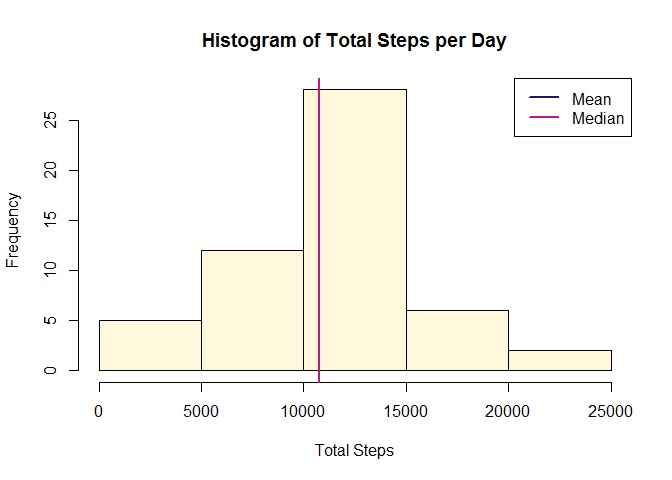
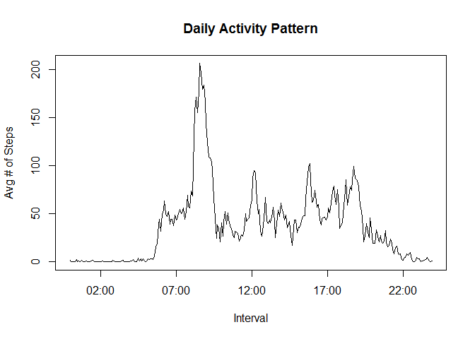
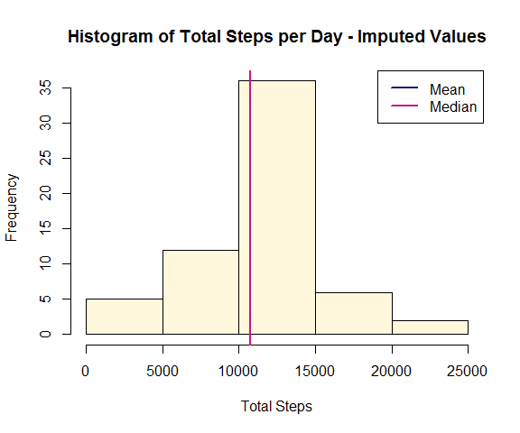
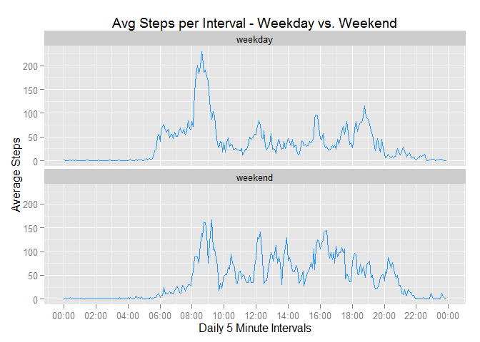

# Reproducible Research: Peer Assessment 1


## Loading and preprocessing the data
These steps will unzip the data file and read the data in R.  Because the zipped file already exists in the directory, no additional steps were needed to download the file.  Just to get a sense of the data set that is involved, a snippet is displayed here.


```r
temp <- "activity.zip"
unzip(temp)
activity <- read.csv("activity.csv", na.strings = "NA")

str(activity)
```

```
## 'data.frame':	17568 obs. of  3 variables:
##  $ steps   : int  NA NA NA NA NA NA NA NA NA NA ...
##  $ date    : Factor w/ 61 levels "2012-10-01","2012-10-02",..: 1 1 1 1 1 1 1 1 1 1 ...
##  $ interval: int  0 5 10 15 20 25 30 35 40 45 ...
```

In order to complete the subsequent analyses, certain R packages will be required.  The code below will load them.


```r
library(plyr)
library(dplyr)
library(ggplot2)
library(scales)
```

Certain global configurations for the knitr package will help to save figures appropriately, and display the R code and results as needed.


```r
knitr::opts_chunk$set(comment=NA, fig.path='figure/', echo=TRUE, warning=FALSE, message=FALSE)
```

## What is mean total number of steps taken per day?
The first analysis performed on the data was to find the total number of steps per day, and look at the results in a histogram, and evaluate the mean and median values.  Because the mean and median values are so close, it is hard to distinguish them on the graph.  The actual mean and median values are shown below the graph.


```r
grp <- filter(activity,!is.na(activity$steps))
grp <- group_by(grp, date)
grp <- summarise_each(grp, funs(sum), steps)

hist(grp$steps, main ="Histogram of Total Steps per Day", xlab = "Total Steps", 
     col = "cornsilk")
abline(v = mean(grp$steps), col = "midnightblue", lwd = 2)
abline(v = median(grp$steps), col = "mediumvioletred", lwd = 2)
legend(x = "topright", c("Mean", "Median"), col = c("midnightblue", "mediumvioletred"), lwd = c(2,2))
```

 

```r
mean(grp$steps)
```

```
[1] 10766.19
```

```r
median(grp$steps)
```

```
[1] 10765
```

## What is the average daily activity pattern?
The next analysis looked at the average daily activity patterns to see if more steps were taken at a specific time of day.  The data was recorded in 5 minute intervals for the entire day, and the plot below shows the average number of steps for each interval, across all of the days in the data set.


```r
avgSteps <- tapply(activity$steps, activity$interval, mean, na.rm=TRUE)
interval <- unique(
        strptime(formatC(activity$interval, width = 4, format = "d", flag = "0"), format = "%H%M"))

plot(interval, avgSteps, type = "l", main = "Daily Activity Pattern", 
     xlab = "Interval", ylab ="Avg # of Steps")
```

 

The interval with the highest average number of steps across all days is "0835", or 8:35 am. 


```r
sprintf("%04d", as.numeric(names(which(avgSteps==max(avgSteps)))))
```

```
[1] "0835"
```

## Imputing missing values
There are a number of missing (NA) values the steps column in the original data set - 2304 to be exact.


```r
length(which(is.na(activity$steps)))
```

```
[1] 2304
```

To understand the bias of these values on the calculations, a new data set was created that replaces the NA values for a given interval by the average for that interval across all days. This uses the average interval values from the previous analysis, and these were spread across each day in order to be used as replacement values.  The columns in the new data set look the same as the original data set, but the NAs have all been replaced, as shown by the output below. 


```r
newValue <- round(rep(as.vector(unlist(avgSteps)), times = 61), digits = 0)
newActivity <- cbind(activity, newValue)
newActivity$steps <- ifelse(is.na(newActivity$steps), newActivity$newValue, newActivity$steps)
newActivity <- select(newActivity, 1:3)
length(which(is.na(newActivity$steps)))
```

```
[1] 0
```

The impact of this on total number of steps per day as well as the mean and median values is not that significant from the original data set. The original data set had almost identical mean and median values - about a 1 step difference.  In the revised data set, there is slightly more variation - about 3 steps. The method used to replace the NA values could have caused this lack of difference in the data sets.  If an interval had many NA values across all days, the average for that interval is likely to be very small as well. Using a daily average as the NA replacement value could have created more variation. 


```r
newSteps <- tapply(newActivity$steps, newActivity$date, sum)

hist(newSteps, main ="Histogram of Total Steps per Day - Imputed Values", 
     xlab = "Total Steps", col = "cornsilk")
abline(v = mean(newSteps), col = "midnightblue", lwd = 2)
abline(v = median(newSteps), col = "mediumvioletred", lwd = 2)
legend(x = "topright", c("Mean", "Median"), col = c("midnightblue", "mediumvioletred"), lwd = c(2,2))
```

 

```r
mean(newSteps)
```

```
[1] 10765.64
```

```r
median(newSteps)
```

```
[1] 10762
```

## Are there differences in activity patterns between weekdays and weekends?
In order to analyze activity patterns between weekdays and weekends, new data needs to be attributed to the data set in order look at this.  For this analysis, the new data set with imputed values to replace the NA values is used.


```r
newActivity$days <- weekdays(as.Date(newActivity$date))
newActivity$dayType <- as.factor(ifelse(newActivity$days %in% c("Saturday", "Sunday"), 
                                        "weekend", "weekday"))

wdy <- filter(newActivity, dayType == "weekday")
gwdy <- group_by(wdy, interval)
wdyAvg <- summarise_each(gwdy, funs(mean), steps)
wdyAvg$dayType <- as.factor(c("weekday"))
wnd <- filter(newActivity, dayType == "weekend")
gwnd <- group_by(wnd, interval)
wndAvg <- summarise_each(gwnd, funs(mean), steps)
wndAvg$dayType <- as.factor(c("weekend"))
dayAvg <- rbind(wdyAvg, wndAvg)
dayAvg$intvl <- as.POSIXct(strptime(formatC(dayAvg$interval, width = 4, 
        format = "d", flag = "0"), format = "%H%M"))

p <- ggplot(dayAvg, aes(intvl, steps))
p + geom_line(col = "dodgerblue") + 
        facet_wrap(~ dayType, ncol=1) + 
        labs(x = "Daily 5 Minute Intervals") + labs(y = "Average Steps") + 
        labs(title = "Avg Steps per Interval - Weekday vs. Weekend") +
        scale_x_datetime(labels = date_format("%H:%M"), breaks = date_breaks("2 hours"))
```

 

In looking at the graph above, it appears as though the activity on the weekends is higher during the middle of the day than it is on weekdays.  On the weekdays, there is a spike of activity in the morning, but less activity throughout the middle of the day.  The weekdays may have the highest average, but the weekends show more periods where the interval average is above 100 steps.
